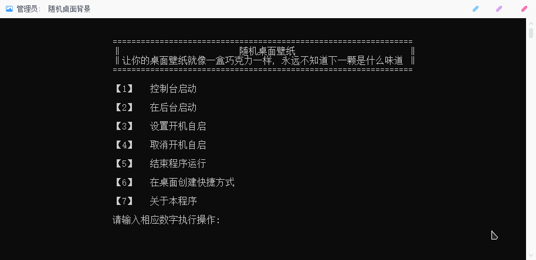
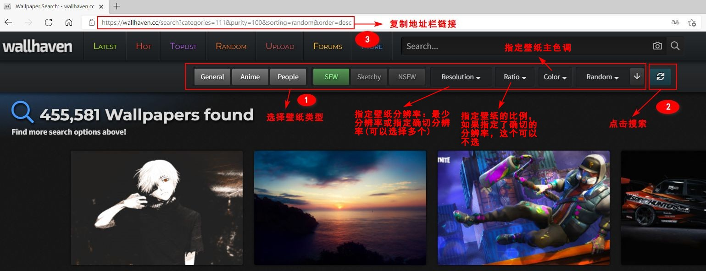
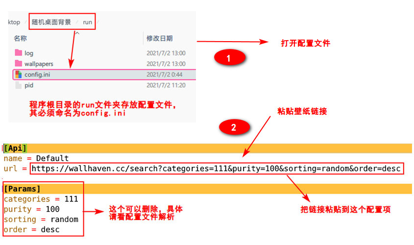
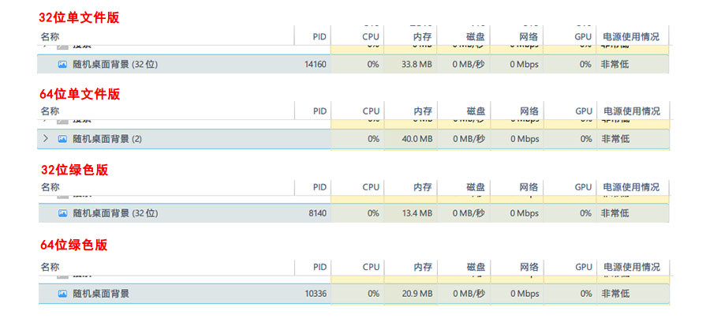

# 随机桌面背景

## 前言

笔者某天突然灵光一闪想到的有趣项目，最后选择使用了Python快速开发，花了几天完成的。克服了很多困难，很多点子都实现了，基本达到了预期。希望这个项目/程序对你有用。


## 程序介绍

使用`Python`编写的自动拉取网络图源并进行自动轮换桌面壁纸的`Windows`应用程序。

使用它，可以让你的桌面背景像一盒巧克力一样，你永远不知道下一颗是什么味道，是惊还是喜，只有等你去探索去发现。

特性：

- 自动拉取网络图源，自动切换桌面背景。

- 可配置。通过配置文件定义壁纸类型、切换间隔等等。
- 支持多种方式启动。一次性启动（控制台、后台）、开机自启。
- 支持全局热键配置。目前支持三个热键：上/下一个桌面背景、定位当前桌面背景文件。

PS：程序所使用的壁纸图源为知名壁纸网站[wallhaven](https://wallhaven.cc/)，程序暂无提供其他图源选择的功能，只能修改参数以获取wallhaven中不同类型的壁纸。


如果对我的项目感兴趣，请不要吝惜你的大拇指给我点个`star`，这将会是对我的最大支持和鼓励！

本项目开源地址：[GitHub](https://github.com/snwjas/RandomDesktopBackground)  |  [Gitee](https://gitee.com/snwjas/random-desktop-background)


本项目开发环境：

- 系统：Windows 10 20H2
- IDE：IntelliJ IDEA
- 语言：Python 3.82


程序控制台界面：




## 如何使用

**本程序使用：**

1. 默认壁纸类型。使用默认配置，基本可以满足大部分需求。

2. 自定义壁纸类型。

   1. 打开壁纸网站[wallhaven Random Wallpapers](https://wallhaven.cc/random)，按照下图步骤选择你的壁纸类型，并复制链接。

      

   2. 打开程序的配置文件，修改`Api -> url`配置项，值为刚复制的链接。

      

   3. 重启程序（结束程序再重新打开）。

3. 自定义更多配置项。请参考配置文件解析。


**本项目使用：**

**运行：**

本项目依赖的第三方库有：`pywin32`、`system_hotkey`、`loguru`、`requests`。requests版本不能太高，否则当启用了系统(IE)代理服务器时会造成壁纸下载失败。

```shell
pip install pywin32
pip install system_hotkey
pip install loguru
pip install requests==2.24.0
```

项目入口为：`application.py`，无参运行时进入程序菜单页面。

**打包：**

程序打包的文件位于`build`文件夹下，可把多个 py 源文件打包成 Windows 上可执行的EXE程序。如需要测试打包，需要安装`pyinstaller`模块，运行`pip install pyinstaller`进行安装。

`build`文件夹下打包所需的文件介绍：

- application.spec：定义打包的一些参数
- version.rc：定义打包的EXE文件的版本信息
- favicon.ico：打包后EXE程序文件的图标
- build.bat：打包脚本，点击执行打包操作

打包后的在该目录下会生成两个文件夹：`build`和`dist`。打包后可执行的程序位于`dist`文件夹下。


## 工作目录

应用程序运行时产生的运行文件保存在应用程序所在根目录的`run`文件夹下，会产生以下文件或文件夹：

- 文件夹：`log`。记录程序的运行日志，程序每天的运行日志保存在一个日志文件，最多保存最近30天的日志。
- 文件夹：`wallpapers`。目录下存放网络拉取的当前轮换的桌面壁纸。如果在配置了`Task -> retainbgs`选项为真，在新壁纸拉取完成时，会把旧的壁纸保存在`wallpapers`目录下的某文件夹，文件夹命名方式为新壁纸拉取完成的日期时间`%Y-%m-%d-%H-%M-%S`，否则会删除旧的壁纸文件。

- 文件：`config.ini`。重要文件！程序运行的所需的配置文件，如果缺失也可以使用默认配置来运行程序。有关可配置选项，请看往下看。
- 文件：`pid`。重要文件！记录当前目录应用程序的线程ID，用以检测程序的运行和结束程序的运行。本程序没有把它放到某个安全的地方、或者使用其他方式以实现相对安全的应用程序全局单例运行。


## 配置文件

程序默认有效配置（该配置会在配置文件缺失时启用），以下`;`后为字段注释：

```ini
[Api]
; 配置你喜欢图源类型的URL，怎么获取请看后面使用，程序会根据该URL获取它的参数信息拉取图源。
; 如果配置了这个选项，那么下面的配置项 [Params] 可以不用配置，相反如果配置了 [Params] 那个这个 url 也可以不用配置。
; 如果我两个都配置会怎么样？答案是会取他们两个的参数值，对于重复的参数以 [Params] 配置的为准，并去掉配置值为空的参数。
; PS：给不认识 URL 格式的朋友提醒一下，URL 中 ? 后的为请求参数，以 & 符号分割多个参数，每项的 = 左边为 Key ，右边为 Value 。
url = https://wallhaven.cc/search?categories=111&purity=100&sorting=random&order=desc

[Params]
categories = 111
purity = 100
sorting = random
order = desc

[Task]
; 桌面背景轮换的时间间隔，单位秒
seconds = 300
; 记录当前壁纸的在轮换壁纸列表中下标，无需修改。作用是程序下一次启动可以从该壁纸重新开始切换。
current = 0
; 下载壁纸时的线程数量，它取值在0-32之间，设为0时取值为设备CPU核心数+4。建议不要作修改，使用的图源网站限流，并发太高会导致壁纸下载失败。
threads = 2
; 下载每张壁纸前的随机暂停时间，随机值在两数之间，两个参数以半角逗号分割，参数可以是小数。它同样是控制下载频率的参数，以提高下载成功率，不建议修改。
rndsleep = 0.0,5.0
; 是否保存旧的壁纸，取值为真或假，具体解析请看上面对工作目录下文件夹wallpapers的解析。
retainbgs = 1

; 热键设置说明：只能是特定小写字符，每个按键间以 + 分割。最多支持3个修饰键(ctrl、shift、alt和win)和一个普通键。按键对应的可取字符值会在下文给出。
; 注意：设置单一的一个键作为热键可能会使原有的按键功能失效，所以慎重采取这样的设置。
[Hotkey]
; 是否启用全局热键，取值为真或假。
enabled = 1
; 切换到上一个桌面背景
hk_prev = control+alt+left
; 切换到下一个桌面背景
hk_next = control+alt+right
; 定位到当前桌面背景文件
hk_locate = control+alt+up
```

注明：对于取值为真假的配置选项，当值为空、0、false、off都表示假，不区分大少写，其他表示真。


## 运行参数

运行程序时可选择的参数：

- 缺省\-r/\-\-run参数：打开程序菜单控制台
- \-h/\-\-help：查看命令参数帮助选项
- \-r/\-\-run：指定程序的运行方式，仅支持一下三种方式
  - console：使用控制台窗口启动，单次启动
  - background：在后台启动，单次启动
  - powerboot：在后台启动，并且开机自启
- \-l/\-\-log：指定运行日志记录的方式，支持以下4中方式
  - file：仅以文件方式记录
  - console：仅以控制台方式打印
  - both：使用文件记录和控制台打印
  - none：关闭运行日志
- \-s/\-\-lnk：根据给的路径创建程序的快捷方式，如果为空则在当前程序路径创建。第1个参数表示创建快捷的路径，它可以是路径；也可以的包含路径的文件名（文件名需含后缀.lnk）；还可以是windows特殊路径，这时它必须以shell:开头，如使用`shell:desktop`表示桌面路径。第二个以后的参数为指定的快捷方式启动参数，需要使用半角双引号把快捷方式启动参数包起来。


示例：

```shell
随机桌面壁纸.exe -r console --log console -s shell:desktop "--run background --log file"
```

命令说明：以上这段命令表示以控制台窗口方式启动`随机桌面壁纸`应用程序，并使用控制台的方式打印运行日志，顺便在桌面创建应用快捷方式。如果运行该快捷方式，将会以后台的方式启动`随机桌面壁纸`应用程序，并使用文件的方式记录运行日志。


## 热键字符

如果需要设置热键，只能使用以下字符表示键位，而且**只能是小写字符**，更多的使用请到[system_hotkey](https://github.com/timeyyy/system_hotkey)查看。

- 修饰键：control、shift、alt、super(说明：win键)
- backspace、tab、return(说明：回车键)、pause、escape(说明：退出、左上角那个)、space、insert、delete
- 大键盘：0-9，a-z；小键盘：kp_0 - kp_9；kp_multiply、kp_add、kp_subtract、kp_decimal、kp_divide
- F键：f1 - f24
- 媒体键：media_play_pause、media_previous、media_next


## 其它说明

- 程序在最后一张壁纸切换完毕后就会重新拉取新的随机壁纸。
- 程序在Windows`锁屏状态`下(WIN+L)不会进行切换，但程序暂时还无法检测屏幕的`关屏状态`，如果你只是关闭了显示器，那么程序仍会自动切换壁纸。
- 如果设置了热键【上/下一个壁纸】，本程序在内部限制了切换按键每次按下生效的间隔时间，这个值为`0.562632`，如果上一次切换到本次切换的时间间隔在这个时间内，壁纸切换不会成功。
- 程序内部限制了拉取壁纸列表的失败次数，这个值为`10`，如果连续获取失败的次数到达这个值，程序会发出提醒。
- 程序在拉取壁纸时使用系统(IE)代理服务器进行请求下载。
- 如果运行程序时不指定日志的记录方式，那么如果是`console`运行，日志记录方式默认为`both`，如果是`background`或`powerboot`运行，日志记录方式默认为`file`。


## 总结

已经很久没碰过Python了，两年多前入门Python做了一下爬虫后就基本没碰过了，这次借着这个项目重拾了一下自己的Python技能。选择Python做的原因主要是Python开发相对简单，丰富的库，可以拿来直接用，满足自己的开发需求进行快速开发。但由于我的Python是入门水平的，而且也很久没接触了，项目中难免会存在很多不规范的地方，请大家多多指教，温柔批评。

还有一点想吐槽的是，Python方便是方便，但是挺有毒的。写了几天Python，我再去写Java、JS，我已经不记得写变量类型和大括号了。[/捂脸]


## 下载

软件分为32位和64位的单文件和绿色版打包，以下为它们各自运行的资源占用情况，大家可以根据自己喜好下载对应的应用程序。



蓝奏云：https://lanzoui.com/b00umf2ej （密码：rdb）

天翼云：https://cloud.189.cn/web/share?code=nENBJvIZZnEv （访问码：05mb）
